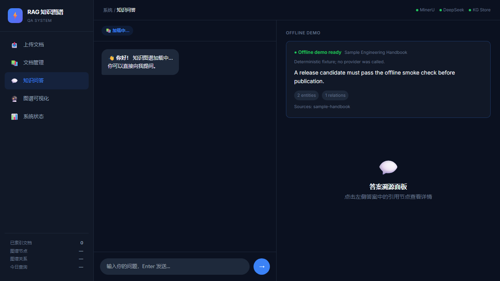

# GraphRAG Agent

[](https://github.com/suiuiui6/graghRAG-agent/actions/workflows/ci.yml)
[](https://github.com/suiuiui6/graghRAG-agent/actions/workflows/public-surface.yml)
[](LICENSE)

Turn documents into a navigable knowledge graph and grounded answers. GraphRAG
Agent is a local React + FastAPI reference application for extraction,
retrieval, and source-aware Q&A.

> 中文简介：GraphRAG Agent 将 PDF、DOCX、PPTX 等资料组织成可追溯的知识图谱，
> 并在本地界面中展示答案与证据。仓库内置无 Provider 的离线演示，便于快速体验；
> 它不是托管平台，也不附带云服务凭据。

## Screenshots



The screenshot is captured from the checked-in offline fixture and shows the
answer, entity/relation counts, and source document identifier.

## Quick Start

The following commands start the application locally in about five minutes.

### Backend (PowerShell)

```powershell
git clone https://github.com/suiuiui6/graghRAG-agent.git
Set-Location graghRAG-agent/backend
python -m venv .venv
.\.venv\Scripts\Activate.ps1
pip install -r requirements.txt
uvicorn server:app --reload
```

### Frontend

In a second shell:

```powershell
Set-Location graghRAG-agent/frontend
npm ci
npm run dev
```

Open the printed Vite URL (normally `http://localhost:5173`). The UI can load
the deterministic demo even when no external provider is configured.

## Offline Demo

The read-only endpoint `GET /api/v1/demo/sample` serves
`fixtures/offline/sample.json`. It returns one handbook sentence, two grounded
entities, one relation, a question, and its source span. The answer is
deterministic, so the smoke check and screenshots are reproducible:

```powershell
python -B tools/run_offline_demo.py
```

Expected output: `offline demo: PASS`. See the [demo walkthrough](docs/demo-walkthrough.md)
for the request/response and UI flow.

## What it does

`upload → parse → extract entities → build graph → retrieve evidence → answer`

Provider integrations (MinerU, DeepSeek, OSS, and Neo4j) remain optional. The
offline fixture is an explicit boundary, not a simulation of provider quality.

## Documentation

- [Getting started](docs/getting-started.md) — install, run, and troubleshoot locally.
- [Demo walkthrough](docs/demo-walkthrough.md) — reproduce the offline answer and source.
- [Architecture](docs/architecture.md) — services, data flow, and boundaries.
- [Evaluation](docs/evaluation.md) — evidence levels, fixtures, and commands.

Goal and Harness Engineering records are optional provenance for contributors;
they are not runtime dependencies for using the application.

## Limitations

This is an evolving application reference, not a hosted service or production
support promise. Provider credentials, Neo4j, browser checks, and deployment
operations require a separate security and operations review.

Live MinerU, DeepSeek, OSS, Neo4j, browser, and production deployment behavior is `not-run`
unless an execution record explicitly says otherwise. Synthetic fixtures and
process smoke checks must not be read as observed Agent+Skill behavior.

## Contributing

Read [CONTRIBUTING.md](CONTRIBUTING.md) and include reproducible commands and
evidence level in issues and pull requests.

## Security

See [SECURITY.md](SECURITY.md). Keep credentials in ignored local `.env` files;
never commit provider keys or production data.

## License

Released under the [MIT License](LICENSE).
